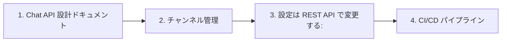

# Index

| # | File | Section |
|---|------|--------|
| 1 | [01-chat-api-設計ドキュメント.md](01-chat-api-設計ドキュメント.md) | Chat API 設計ドキュメント |
| 2 | [02-チャンネル管理.md](02-チャンネル管理.md) | メッセージング > チャンネル管理 |
| 3 | [03-設定は-rest-api-で変更する.md](03-設定は-rest-api-で変更する.md) | 通知設定 > 設定は REST API で変更する: |
| 4 | [04-ci-cd-パイプライン.md](04-ci-cd-パイプライン.md) | デプロイメント > CI/CD パイプライン |

## Graph

